# [붙임 3] 2026년 임업통계 활용 경진대회 데이터 분석 결과서

**임업통계 마이크로데이터 기반 임가 맞춤형 수익성 예측 및 경영 개선 시스템**

| 구분 | 내용 |
|---|---|
| 공모 분야 | 데이터 분석 |
| 활용 임업통계 | 임가경제조사 · 임산물생산비조사 · 임산물생산조사 · 임업경영실태조사 (4종) |
| 융복합 공공데이터 | KAMIS 도매가격 · 산림청 보조금 세부사업 · 기상청 지상관측 |
| 산출물 | 예측 모델 4종 · 분석 파이프라인 10종 · 웹 서비스 (FastAPI + Vue 3) |
| 작성일 | 2026-07-31 |

---

## 1) 추진배경 및 필요성

### 1-1. 현황 — 평균값만 있고 내 이야기는 없다

산림청과 한국임업진흥원이 매년 공표하는 임업통계는 전국·지역·업종 단위의 **거시 평균값**
형태로 제공된다. "밤재배업 임가의 평균 임업소득은 ○○만원"과 같은 집계치는 산업 전체의
추세 파악에는 유효하지만, **개별 임가가 자신의 조건에서 얼마를 벌 수 있는지**에 대해서는
답하지 못한다.

본 분석에서 확인한 실증적 근거는 다음과 같다.

- 현행 방식(지역별×업종별 단순 평균)을 예측기로 사용하면 설명력이
  **R² = 0.0428** 에 그친다.
  평균값은 개별 임가 성과의 **4.3%밖에 설명하지 못한다.**
- 학습셋 기준 임가 간 ROI 표준편차가 **216.7%p** 로, 같은 업종·지역
  안에서도 성과 편차가 매우 크다.
- 동일 품목이라도 지역에 따라 kg당 수취 단가가 최대 **2.9배** 차이난다(4-9절).
- 같은 밤인데 출하시기에 따라 단가가 **1.82배** 갈리는데, 정작 가장 불리한 시기에
  임가의 절반 이상이 출하한다(4-10절).

즉 임가가 실제로 마주하는 의사결정 — 얼마를 투입할지, 언제 어디에 팔지, 등급을 어떻게
관리할지 — 에 대해 현행 통계는 답을 주지 못하고 있다.

### 1-2. 문제점

| 문제 | 구체적 내용 |
|---|---|
| 평균의 함정 | 지역·업종 평균은 규모·자본·노동력이 다른 임가를 한 덩어리로 묶어, 소규모 임가에는 과대, 대규모 임가에는 과소 안내가 된다 |
| 사전 의사결정 지원 부재 | 임가가 알고 싶은 것은 "경영비를 얼마나 투입해야 하는가"인데, 사후 결산 통계만으로는 투입-성과 곡선을 알 수 없다 |
| 조사 간 단절 | 수익성(임가경제)·비용구조(생산비)·가격(생산조사)·경영행동(경영실태)이 각각 따로 공표되어, 임가 관점에서 하나의 답으로 이어지지 않는다 |
| 불확실성 미표시 | 임업 수익은 기상·병충해·시세에 크게 좌우되는데 평균값만 제시되어 확정값처럼 오독된다 |

### 1-3. 필요성

임업통계 **원데이터(마이크로데이터)** 는 임가 단위 관측치를 담고 있어, 집계 이전 단계에서
기계학습을 적용하면 **개별 임가 특성에 조건부인 성과 예측**이 가능하다. 본 과제는 이미
수집·축적된 국가승인통계 4종을 계층적으로 결합해, **추가 조사 비용 없이** 임가 맞춤형
의사결정 도구로 전환하는 것을 목표로 한다.

---

## 2) 기획 세부 내용

### 2-1. 솔루션 개요

임가가 자신의 제원(작목·지역·임지규모·연간 경영비)을 입력하면

1. **예상 수익을 금액으로** 제시하고 (퍼센트가 아니라 "622만원 남습니다")
2. **잘될 때와 안될 때의 범위**를 함께 보여주며
3. **무엇을 바꾸면 나아지는지**를 실행 가능한 문장으로 안내한다
   (얼마를 덜 쓰면 더 남는지, 언제 어디에 팔면 값을 더 받는지, 어떤 보조사업을 쓸 수 있는지)

### 2-2. 시스템 구조

```
[임가경제조사]  [임산물생산비조사]  [임산물생산조사]  [임업경영실태조사]
   2019~2023        2018~2024          2022~2024        2018·2020
      │                  │                   │                │
 preprocess.py    preprocess_cost.py    production.py    management.py
      │                  │                   │                │
 ┌────┴─────┐      ┌─────┴─────┐             │                │
 │ Model A  │      │  Model B  │        지역별 단가       출하시기·판로
 │ 임가 단위 │      │  품목 단위 │        주산지 특화도     저장·인증 효과
 └────┬─────┘      └─────┬─────┘             │                │
      │  train_quantile.py (예측구간)         │                │
      └──────────┬───────────────────────────┴────────────────┘
                 │        ┌──────────────────────────────┐
                 │        │ KAMIS 도매가 · 산림청 보조금   │
                 │        │ 기상청 지상관측 (검증용)       │
                 │        └──────────────┬───────────────┘
                 └──────────┬────────────┘
                            ▼
              FastAPI (api/) + Vue 3 (web/)
        임가용 쉬운 화면 · 전문가용 상세 분석 화면
```

### 2-3. 두 계층이 답하는 질문

| 계층 | 데이터 | 답하는 질문 |
|---|---|---|
| **Model A** | 임가경제조사 총괄 | "내 임가 전체가 올해 얼마를 남길 수 있나?" |
| **Model B** | 임산물생산비조사 | "이 품목을 ha당 이렇게 투입하면 얼마가 남나? 비목 배분은 적정한가?" |
| 기술통계 계층 | 생산조사 · 경영실태조사 | "무엇을 바꾸면 더 벌 수 있나?" |

### 2-4. 주요 기능

| 기능 | 핵심 기술 | 임가에게 주는 답 |
|---|---|---|
| 수익 예측 | CUDA XGBoost + Optuna | "1,500만원 쓰시면 622만원 남습니다" |
| 예측구간 | 분위수 회귀 (P10/P50/P90) | "잘 풀리면 4,372만원, 안 풀리면 -690만원" |
| 경영비 최적화 | 모델 기반 what-if | "707만원 덜 쓰시면 554만원 더 남습니다" |
| 출하시기 추천 | 구성비 NNLS 회귀 | "수확~추석에 파시면 kg당 5,875원" |
| 판로 비교 | 구성비 NNLS 회귀 | "직거래가 도소매상보다 1.35배" |
| 등급 개선 효과 | 등급별 단가 실측 | "소→중 전환 10%p면 ha당 +75,178원" |
| 지역 단가 비교 | 물량가중 단가 | "경기 3,521원 vs 경남 2,095원" |
| 정책 연계 | 자부담 기준 환산 | "자부담 20% 사업 쓰면 실효 250%" |

---

## 3) 데이터 분석 방법

### 3-1. 활용 데이터

| 구분 | 제공기관 | 데이터명 | 대상 연도 | 활용 |
|---|---|---|---|---|
| **임업통계(필수)** | 통계청 MDIS / 산림청·한국임업진흥원 | **임가경제조사 총괄(제공) 마이크로데이터** | 2019~2023 | Model A |
| **임업통계(필수)** | 통계청 MDIS / 산림청 | **임산물생산비조사** (밤·대추·떫은감·표고 노지·톱밥) | 2018~2024 | Model B, 등급·수령 분석 |
| **임업통계(필수)** | 통계청 MDIS / 산림청 | **임산물생산조사 전품목** | 2022~2024 | 지역별 단가·특화도 |
| **임업통계(필수)** | 통계청 MDIS / 산림청 | **임업경영실태조사** (밤·떫은감·버섯·임업경영인) | 2018, 2020 | 출하시기·판로·인증 |
| 공공데이터 | 한국농수산식품유통공사 | KAMIS 품목별 도매가격 | 최근 12~15개월 | 월별 가격 계절성 |
| 공공데이터 | 산림청 | 보조금 세부사업 정보 | 2021-10-21 공개 | 자부담 기준 실효 ROI |
| 공공데이터 | 기상청 API 허브 | 지상관측(ASOS) 일자료 | 2019~2024 | 결합 효과 검증 (4-7절) |

임가경제조사·임산물생산비조사·임산물생산조사·임업경영실태조사는 모두 **산림청 국가승인통계**로
공모요강이 요구하는 필수 마이크로데이터 요건을 충족한다.

### 3-2. 데이터 전처리

| 단계 | 처리 내용 | 결과 |
|---|---|---|
| ① 적재 | MDIS 배포본의 CP949/EUC-KR 인코딩과 구분자를 자동 탐지, ZIP 자동 해제 | — |
| ② 코드북 파싱 | 파일설계서(xlsx) '코드정보' 시트를 파싱해 코드→한글 라벨 사전 자동 생성 (실패 시 폴백) | 6개 범주 |
| ③ 스키마 표준화 | 연도별 표기 흔들림 흡수 (아래 3-3) | — |
| ④ 결측 처리 | MDIS 결측코드(-9, -8, -7 등)를 `NaN`으로 치환 | — |
| ⑤ 정의역 정제 | 임업 미영위 임가(경영비 0 또는 총수입 0) 제외 | A: 450건 제외 |
| ⑥ IQR 이상치 제거 | 목표변수에 1.5×IQR, 비용 항목에 3.0×IQR. Model B는 단위 분모가 달라 **품목별로** 적용 | A: 1,052건 / B: 317건 |
| ⑦ 파생변수 | 구간 범주의 대표값 수치화, ha당 지표, 로그변환, 비목 구성비, 노동 배분 | A: 22개 / B: 169개 |

**최종 분석 표본** — Model A **4,438행**(원시 5,940행),
Model B **4,712행**(원시 5,029행)

### 3-3. 연도별 스키마 불일치 해소

실제 배포본에서 마주친 문제와 처리 방식이다. 이 작업 없이는 연도 간 결합 자체가 불가능하다.

| 문제 | 사례 | 처리 |
|---|---|---|
| 영문 변수코드 접두사 | 2021년 임가경제조사만 `FMI_임업소득` 형태 | 정규식으로 접두사 제거 |
| 항목명 변경 | 2019~2020 `임외소득` ↔ 2022~ `임업외소득` | 별칭 사전으로 통일 |
| 접미 숫자 | 생산비조사 `무기질비료_질소질_지출액1`, `…2` | 말미 숫자 제거 |
| 단위 분모 상이 | 밤·대추·떫은감은 `ha당`, 표고는 `만본당` | `_단위당`으로 통일하고 ROI(비율)로 비교 |
| **코드 체계 변경** | 「경영수준별」이 2020~2022년은 5·6, 2023~2024년은 1·2 | **5→1, 6→2로 조화 (2,239행)** |

특히 마지막 항목은 2024년 파일설계서에 1·2만 문서화되어 있어 발견하기 어려웠다. 구성비가
약 20:80으로 동일한 점을 근거로 동일 개념임을 확인했다. 조화하지 않으면 같은 개념이 4개
범주로 쪼개져 **연도 코호트로 오분할**된다.

### 3-4. 정보 누출(Data Leakage) 통제 — 분석 타당성의 핵심

목표변수가 `ROI = 임업소득 ÷ 임업경영비` 이고 `임업소득 = 임업총수입 − 임업경영비` 이므로,
**임업총수입·임업소득 및 이를 포함하는 모든 합계항목**을 설명변수에서 전면 배제했다.

> Model A 제외: 임업총수입, 임업소득, 임가소득, 경상소득, 임가순소득, 임가처분가능소득, 임가경제잉여

반면 **임업경영비는 유지**했다. ROI의 분모이기는 하나 분자인 임업총수입을 결정하지 않으며,
임가가 영농계획 시점에 스스로 정하는 **사전(ex-ante) 의사결정 변수**이기 때문이다.
이는 대시보드의 "경영비를 얼마나 투입할 것인가" 시뮬레이션 기능의 전제이기도 하다.

**Model B에서 실제로 누출이 발생했고, 이를 발견해 수정했다.** 1차 학습 결과가 Test R² 0.9102로
비정상적으로 높아 피처를 감사한 결과 다음이 섞여 있었다.

| 누출 피처 | 정체 |
|---|---|
| `총생산액(생감기준)_단위당` | **총수입 그 자체** |
| `부가가치` | 총수입 − 중간재비 |
| 특대/대/중/소 수량, 생대추·건대추 수량, 생감·건시·감말랭이 수량, 생표고·건표고 수량 | 사후 실적 수량 |

**수량 × 단가 = 총수입**이므로 수량을 남기면 목표변수가 거의 그대로 복원된다. 실제로
`건표고_소계수량`과 ROI의 상관이 **0.885** 였다. 기존 규칙이 '평가액·수확량·생산량'만 잡고
'수량' 자체를 놓쳤고 '생산액'·'부가가치' 패턴도 없었다.

산출측은 금액이든 수량이든 예외 없이 배제하도록 규칙을 강화했다. 단 무기질·유기질
**시비량**은 산출이 아니라 투입이므로 유지했다. 수정 후 목표변수와의 최고 상관은
**0.885 → 0.344**(노동비 비중)로 정상화되었고, Test R²는 0.9102에서
**0.6243** 로 내려왔다.
**이것이 사전 정보만으로 얻을 수 있는 실제 예측력이다.**

### 3-5. 분석 절차

1. **데이터 분할** — Train 3,550 / Validation 444 / Test 444
   (80:10:10, `random_state=42`). Model B는 품목별 층화 추출.
2. **베이스라인 3종 구성**
   - ① *산림청 단순평균*: 학습셋의 지역별×업종별(Model B는 품목별×지역별) 산술평균을 그대로
     예측값으로 사용 — **현행 통계 공표 방식의 재현**
   - ② *다중 선형회귀*: One-Hot 인코딩 + 표준화 후 OLS
   - ③ *Optuna-XGBoost*: 제안 모델
3. **하이퍼파라미터 최적화** — Optuna TPE(multivariate) **300회 시행**,
   목적함수는 학습셋 **5-fold 교차검증 OOF RMSE**. 단일 검증셋 과적합을 막기 위해
   시행마다 5개 모델을 학습한다 (총 1,500회 부스팅 학습).
   탐색 공간에 **목표변수 부호보존 로그변환 여부**도 포함했다.
4. **최종 학습** — 교차검증 평균 최적 부스팅 라운드로 Train+Validation 전체(90%) 재학습
5. **평가** — 학습에 한 번도 사용하지 않은 Test set으로 R²·RMSE·MAE 산출
6. **불확실성 정량화** — 분위수 회귀로 P10/P50/P90 학습, 구간 포함률로 캘리브레이션 검증

### 3-6. 하드웨어 가속 및 사용 프로그램

- **GPU 가속** — `tree_method='hist'`, `device='cuda'`. Optuna 워커 스레드를
  **NVIDIA RTX A6000 2장에 라운드로빈 배정**해 병렬 탐색.
- **소프트웨어** — Python 3.11, XGBoost 3.2, Optuna 4.9, scikit-learn 1.9, SHAP 0.51,
  SciPy 1.17(NNLS), pandas 3.0, FastAPI 0.14, Vue 3.5, ECharts 5.5

---

## 4) 분석 내용 및 결과

### 4-1. 【Model A】 임가경제조사 기반 임가 단위 모델

| 모델 | R² (↑) | RMSE (%p, ↓) | MAE (%p, ↓) |
|---|---:|---:|---:|
| ① 산림청 단순평균 (현행 공표 방식) | 0.0428 | 192.03 | 152.95 |
| ② 다중 선형회귀 | 0.1295 | 183.13 | 143.50 |
| ③ **Optuna-XGBoost (제안 모델)** | 0.1736 | 178.44 | 137.31 |

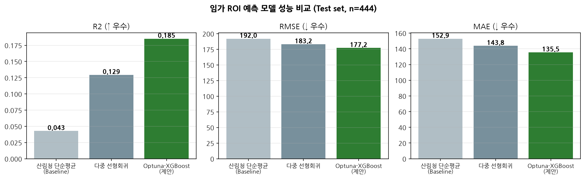

- 제안 모델의 R²는 **0.1736** 로 현행 산림청 단순평균 방식
  (0.0428) 대비 **4.1배**
- 예측 오차는 **RMSE 7.1%, MAE 10.2% 감소**
- 교차검증 OOF(RMSE 193.94, R² 0.1986)가 Test 성능과
  유사해 **과적합 없이 일반화**되었다

> **성능 해석에 관한 유의.** 임가 ROI는 기상·병충해·시장가격 등 관측되지 않은 요인의 영향을
> 크게 받는, 본질적으로 잡음이 큰 변수다. R²의 절대 수준보다 **동일 데이터·동일 평가셋에서
> 현행 방식 대비 얼마나 개선되는가**가 정책적으로 의미 있는 비교다. 이 점을 회피하지 않기 위해
> 4-6절에서 예측구간을, 4-7절에서 기상 결합 검증 결과를 함께 제시한다.

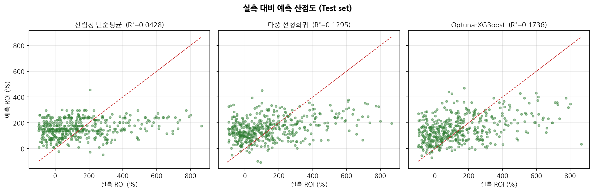

### 4-2. 변수 중요도

| 순위 | 변수 | Gain |
|---:|---|---:|
| 1 | 업종별 | 15,626 |
| 2 | log_임업경영비 | 14,521 |
| 3 | 임업경영비 | 12,469 |
| 4 | log_ha당_경영비 | 12,120 |
| 5 | 경영비_자본비율 | 11,387 |
| 6 | 전/겸업별 | 10,909 |
| 7 | ha당_경영비 | 10,767 |
| 8 | 임업외소득_비중 | 10,703 |
| 9 | 지역별 | 10,550 |
| 10 | 지역x업종 | 10,134 |

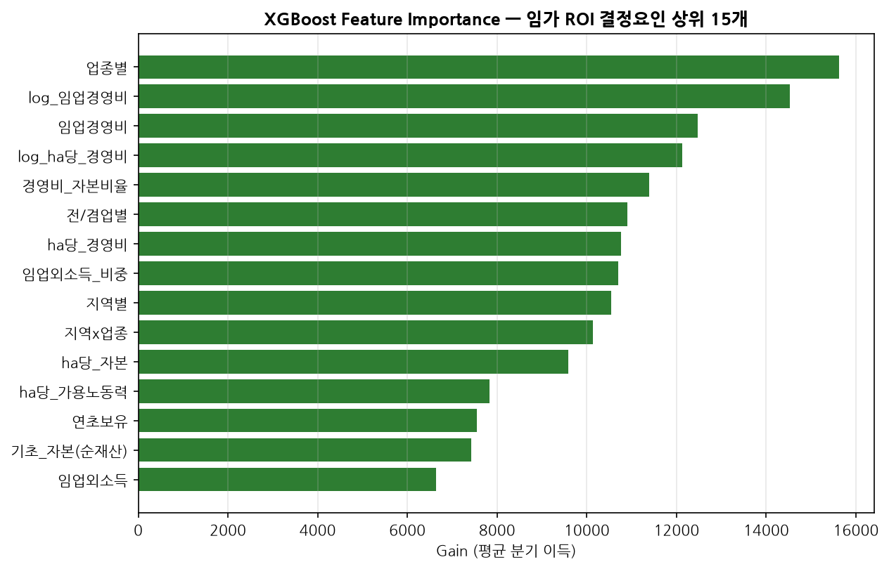

업종별과 경영비 계열(로그·ha당·자본비율)이 상위를 차지한다. ROI가 투입 대비 성과 지표인 만큼
자연스러운 결과인 동시에, **경영비 투입 수준이 임가가 직접 통제할 수 있는 가장 강력한 지렛대**
임을 뜻한다. 대시보드의 경영비 반응곡선 기능은 이 지점을 실무적으로 활용한 것이다.

### 4-3. 업종별 ROI 프로파일

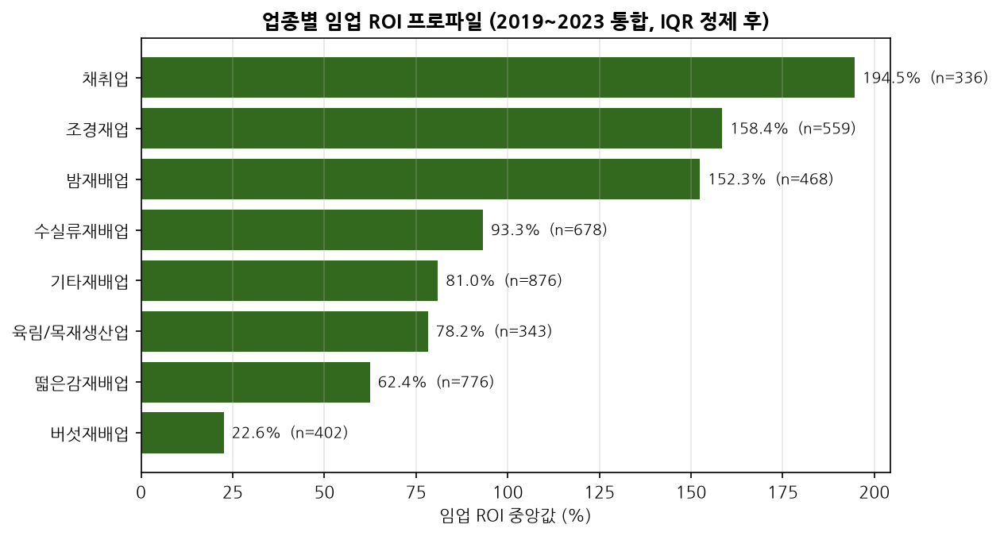

### 4-4. 【Model B】 임산물생산비조사 기반 품목 단위 모델

| 항목 | 내용 |
|---|---|
| 데이터 | 산림청 「임산물생산비조사」 마이크로데이터 |
| 대상 | 밤·대추·떫은감(2020~2024), 표고 노지·톱밥(2018~2022) |
| 분석 표본 | **4,712행** (떫은감 1,743 · 대추 1,284 · 밤 1,140 · 표고 노지 333 · 표고 톱밥 212) |
| 목표변수 | 단위면적당 ROI(%) = 소득 ÷ 경영비 × 100 |
| 설명변수 | 169개 — 비목별 지출, 작업 공정별 노동시간, 수령·재배면적·재배본수 |
| 단위 | 밤·대추·떫은감은 ha당, 표고(노지)는 만본당 기준. ROI는 비율이므로 품목 간 비교 가능. |

#### 성능 (Test set, n = 472)

| 모델 | R² (↑) | RMSE (%p, ↓) | MAE (%p, ↓) |
|---|---:|---:|---:|
| ① 산림청 단순평균 (현행 공표 방식) | 0.1049 | 156.39 | 121.43 |
| ② 다중 선형회귀 | 0.4894 | 118.12 | 88.44 |
| ③ **Optuna-XGBoost (제안 모델)** | 0.6243 | 101.33 | 75.61 |

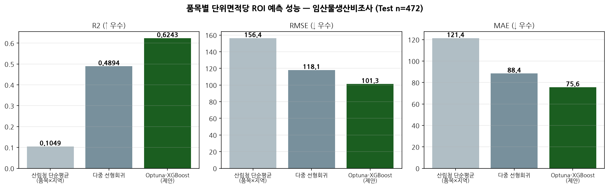

베이스라인 대비 **RMSE 35.2%, MAE 37.7% 감소**.
교차검증 OOF R² 0.6390 가 Test 0.6243 와 유사해 과적합이 없다.

#### 품목별 정확도

| 품목 | Test 표본 | R² | RMSE | MAE |
|---|---:|---:|---:|---:|
| 떫은감 | 167 | 0.591 | 127.2 | 95.9 |
| 대추 | 133 | 0.589 | 100.3 | 77.6 |
| 밤 | 123 | 0.584 | 69.9 | 55.1 |
| 표고 톱밥 | 17 | 0.171 | 66.3 | 55.1 |
| 표고 노지 | 32 | -0.052 | 63.6 | 51.1 |

밤·대추·떫은감은 R²가 0.58~0.59로 고르지만 표고는 크게 낮다. 표고 노지 333행,
톱밥 212행으로 표본이 작고 단위 분모(만본당)도 달라 학습이 충분하지 않았다.
이 한계를 감추지 않고 그대로 기재한다.

#### 결정요인 (Gain 상위 12)

| 순위 | 변수 | Gain |
|---:|---|---:|
| 1 | 경영수준별 | 281,394 |
| 2 | 정지_시간_단위당 | 131,946 |
| 3 | 노동비_비중 | 125,716 |
| 4 | 노동시간당_경영비 | 90,220 |
| 5 | 골목폐기_시간_단위당 | 60,394 |
| 6 | 시설물보수_시간_단위당 | 58,017 |
| 7 | 농약비_비중 | 56,200 |
| 8 | 골목세우기_시간_단위당 | 55,620 |
| 9 | 총노동시간_보통고용_단위당 | 42,161 |
| 10 | 골목벌채_시간_단위당 | 41,183 |
| 11 | log_경영비 | 34,999 |
| 12 | 골목눕히기_시간_단위당 | 34,245 |

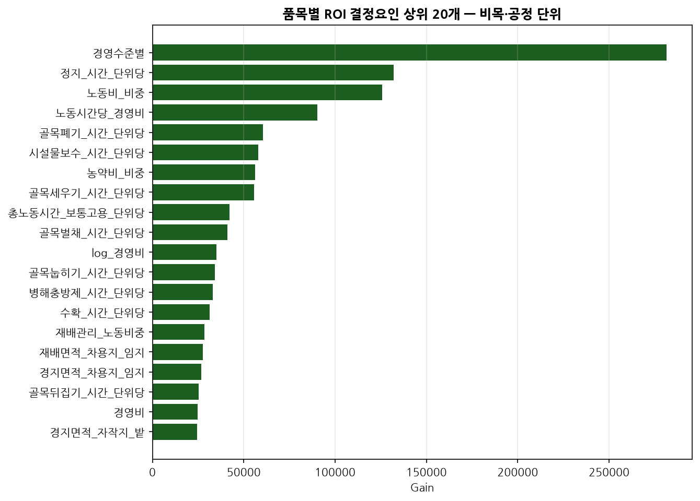

상위가 **작업 공정별 노동시간**(정지·골목폐기·골목세우기·병해충방제·수확)과
노동비 비중으로 채워진다. 산출측 정보를 전혀 쓰지 않고 **투입 구조만으로**
수익성을 설명한다는 뜻이며, 임가가 통제할 수 있는 변수들이라는 점에서
실무적으로도 의미가 있다.

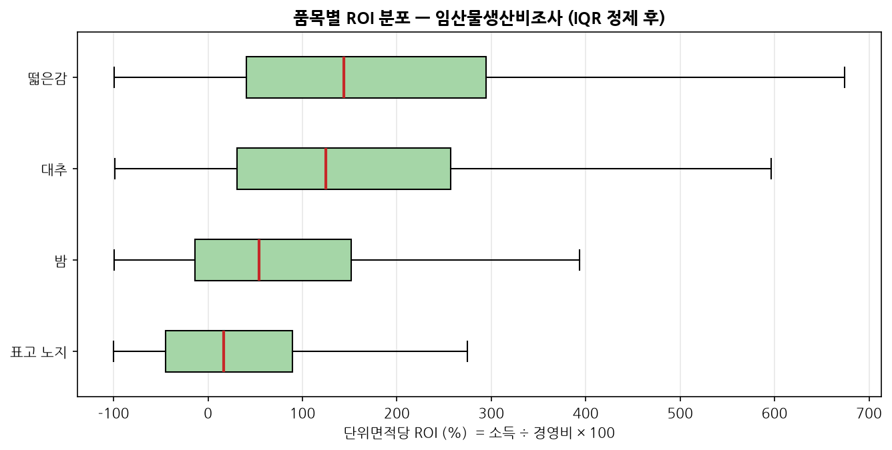

### 4-5. 두 모델의 격차가 말하는 것

| | Model A | Model B |
|---|---|---|
| 데이터 | 임가경제조사 총괄 | 임산물생산비조사 |
| 관측 단위 | 임가 전체 | 품목 × 단위면적 |
| 설명변수 | 22개 (구조 변수 중심) | 169개 (비목·공정 포함) |
| Test R² | **0.1736** | **0.6243** |

같은 임업 수익성인데 설명력이 3.6배 차이난다.
원인은 모델이 아니라 **데이터의 해상도**다. 임가경제조사 총괄은 지역·업종·규모 같은
구조 변수까지만 담고 있어 "어떤 임가인가"는 알 수 있어도 "무엇을 어떻게 했는가"는
알 수 없다. 반면 생산비조사는 비목별 지출과 공정별 노동시간을 담고 있어 경영 행동이
드러난다.

**이것이 본 과제가 2계층 모델을 택한 이유다.** 임가 단위 종합 진단은 Model A가,
품목 단위 정밀 진단은 Model B가 맡는다. 동시에 이는 마이크로데이터 개방 정책에
대한 시사점이기도 하다 — 조사 항목의 상세도가 곧 분석 가능성의 상한이다.

### 4-6. 예측구간 — 불확실성을 숨기지 않기

임가 ROI는 기상·병충해·시장가격 등 조사되지 않는 요인의 영향을 크게 받는다.
점추정만 제시하면 확정값으로 오독되므로, 분위수 회귀(`reg:quantileerror`)로
P10·P50·P90을 학습해 **구간으로 제시**한다.

| 모델 | Test 표본 | 구간 포함률 (명목 80%) | 구간폭 중앙값 | P50 MAE |
|---|---:|---:|---:|---:|
| Model A (임가경제조사) | 444 | 78.2% | 439.4%p | 137.33%p |
| Model B (임산물생산비조사) | 472 | 76.5% | 209.9%p | 74.49%p |

포함률이 명목 80%에 근접해 구간이 신뢰할 만하다. Model B의 구간폭이 Model A의
절반 이하인 점도 4-5절의 결론과 일치한다 — **정보가 상세할수록 불확실성도 준다.**

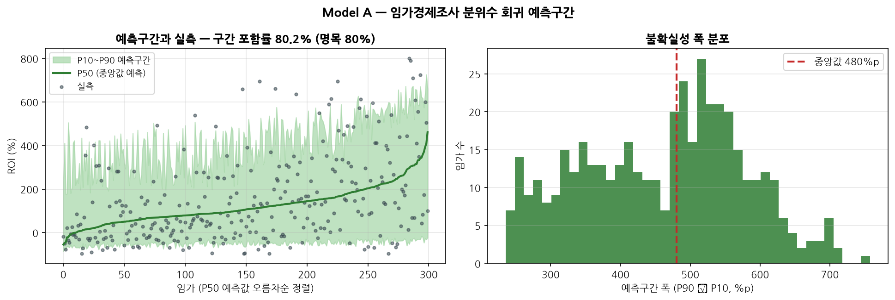

### 4-7. 기상 자료 결합 검증 — 가설을 실제로 시험하다

"R²가 낮은 것은 기상 등 관측되지 않은 요인 때문"이라는 설명은 검증 없이 쓰면
변명에 그친다. 기상청 API 허브에서 **지상관측(ASOS) 일자료 2019~2024, 전국 97개
지점 210,111행**을 수집해 실제로 넣어 보았다.

파생 지표는 생육기(4~10월) 기온·강수, 서리일수, **초상서리일수**(지면 가까이 온도로
실제 서리 피해와 직결), **개화기(4~5월) 저온일수**, 폭염일수, 호우일수 등 15개다.
산간 고지대 관측소(고도 600m 초과)와 관측일수 300일 미만은 지역 대표성이 없어 제외했다.

| 조건 | R² | RMSE | MAE |
|---|---:|---:|---:|
| 기상 미포함 (최종 채택) | **0.1736** | 178.44 | 137.31 |
| 기상 15개 피처 포함 | 0.1474 | 181.24 | 141.34 |

**성능이 오히려 내려갔다.** 그런데 기상 피처가 전체 중요도의 41.8%를 차지한다 —
모델은 기상을 열심히 쓰는데 예측은 나빠졌다는 뜻이다.

원인은 **결합 단위의 불일치**다. 임가경제조사의 지역 구분이 시도 9개뿐이라 기상은
시도×연도 54개 조합으로만 붙고, 4,438개 임가가 54개 값을 나눠 갖는다. 이미
`지역별`과 `조사연도`가 설명변수에 있으므로 기상 15개는 **같은 정보를 잘게 쪼개
넣은 셈**이고, 트리가 여기에 과적합해 검증 성능이 떨어졌다.

따라서 최종 모델에서는 기상을 제외했다. 다만 이 실험이 남긴 결론이 더 중요하다.

> **시도 단위 연평균 기상으로는 임가 간 수익성 차이를 설명할 수 없다.**
> 같은 도에서 같은 해에 농사지어도 임가마다 성과가 크게 갈리며, 그 차이는
> 광역 기후가 아니라 개별 임지의 미기후·경사·향·토양과 경영 행동에서 온다.

이는 5-4절의 통계 개선 제언으로 직접 이어진다.

### 4-8. 수익 개선의 정량 근거 (기술통계 계층)

예측 모델이 "얼마를 벌 수 있는가"에 답한다면, 이 계층은 **"무엇을 바꾸면 나아지는가"**
에 답한다. 원데이터에서 직접 추출했으며 예측 모델의 설명변수로는 쓰지 않는다.

#### ① 품질 등급별 단가 — 밤

| 등급 | 단가 (원/kg) | 이 등급을 내는 임가 비율 |
|---|---:|---:|
| 특대 | 3,800 | 70% |
| 대 | 2,800 | 94% |
| 중 | 1,851 | 76% |
| 소 | 900 | 61% |

최고/최저 **4.22배** 격차다.
선별 강화로 소 → 중 물량 10%p 전환 시 단위면적당 수취액이 **+75,178원** 늘어난다.

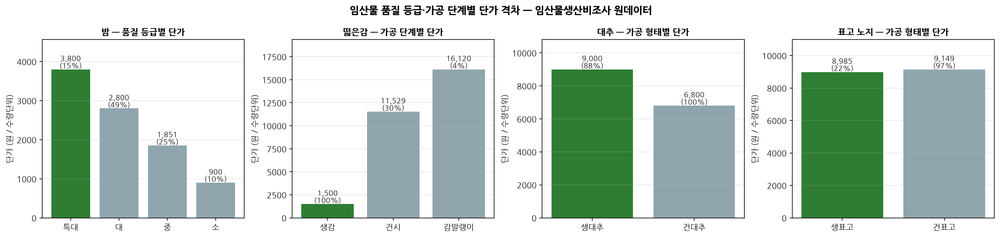

#### ② 수령별 수익성 — 갱신·개식 판단 근거

| 품목 | 최고 수익 구간 | 최저 구간 |
|---|---|---|
| 밤 | 16~20년 (62%) | 40년 초과 (-5%) |
| 대추 | 31~40년 (147%) | 10년 이하 (81%) |
| 떫은감 | 21~25년 (173%) | 10년 이하 (57%) |

수익이 정점을 지나 하락하는 구간은 갱신·개식 또는 수형 개선을 검토할 시점을 시사한다.

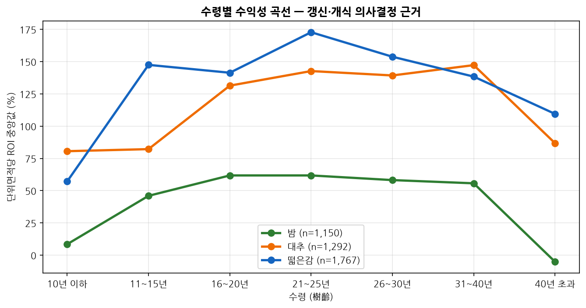

#### ③ 선도임가 벤치마크

「경영수준별」 코드로 선도임가와 이외임가의 **비목 구성비·노동시간 차이**를 비교했다.
선도임가는 조사에서 성과 기준으로 분류된 집단이므로 ROI 격차의 크기 자체는 부분적으로
정의상 내생적이다. 실무적으로 활용할 부분은 격차의 크기가 아니라 **돈을 어디에 얼마나
쓰는지의 구조적 차이**다.

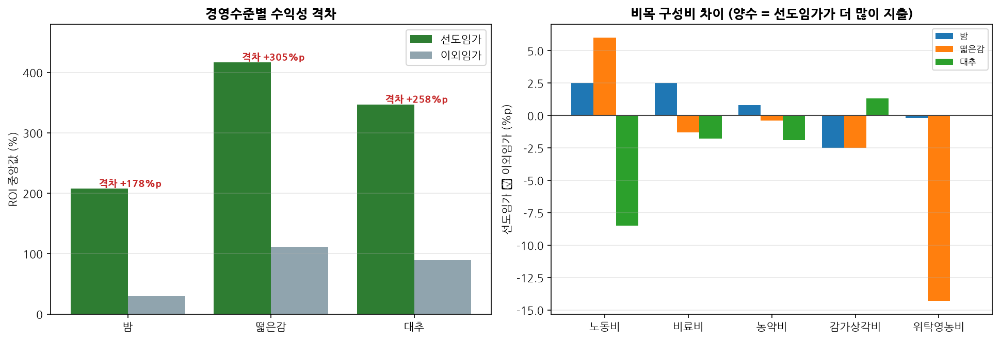

### 4-9. 임산물 시장 구조 — 전 품목 지역별 실측 단가

KAMIS 일일 가격조사는 63개 품목만 다루며 임산물은 단감·느타리·새송이·팽이버섯뿐이다.
밤·대추·떫은감·표고·산나물의 가격 정보가 통째로 비어 있었는데,
「임산물생산조사」 전품목(2022~2024년, 196,579개 시군구-품목 관측)이
이 공백을 임업통계만으로 메운다.

#### 단가·생산량 추이

| 품목 | 2022년 (원/kg) | 2024년 | 단가 변화 | 생산량 변화 |
|---|---:|---:|---:|---:|
| 밤 | 2,429 | 2,699 | +11.1% | -14.4% |
| 떫은감 | 1,260 | 1,263 | +0.3% | -10.5% |
| 대추 | 9,999 | 10,067 | +0.7% | -5.2% |
| 생표고 | 9,570 | 9,061 | -5.3% | -4.0% |
| 건표고 | 37,892 | 37,407 | -1.3% | -15.3% |
| 고사리 | 6,982 | 6,761 | -3.2% | +17.2% |
| 더덕 | 13,152 | 16,618 | +26.4% | -19.0% |
| 도라지 | 19,207 | 21,529 | +12.1% | -14.9% |
| 호두 | 14,413 | 14,859 | +3.1% | -2.2% |
| 잣 | 14,032 | 17,414 | +24.1% | -6.8% |

**대부분 품목에서 생산량이 줄고 단가가 오른다.** 공급 축소가 가격을 밀어올리는 구조이며,
임업 인구 감소가 남은 임가에게는 가격 측면에서 유리하게 작용하고 있음을 보여준다.

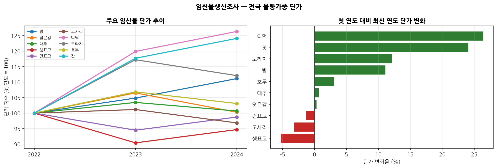

#### 지역별 단가 격차

| 품목 | 최고 지역 (원/kg) | 최저 지역 | 격차 |
|---|---|---|---:|
| 밤 | 경기 3,521 | 경남 2,095 | 1.68배 |
| 떫은감 | 경기 1,958 | 경북 1,136 | 1.72배 |
| 대추 | 대전 17,932 | 대구 7,782 | 2.30배 |
| 생표고 | 인천 10,946 | 전남 7,267 | 1.51배 |
| 건표고 | 경남 54,797 | 충남 29,283 | 1.87배 |
| 고사리 | 경기 9,954 | 대구 4,106 | 2.42배 |
| 더덕 | 경북 17,297 | 경기 15,883 | 1.09배 |
| 도라지 | 경기 22,479 | 세종 7,731 | 2.91배 |
| 호두 | 전남 23,375 | 대전 10,000 | 2.34배 |
| 잣 | 경기 26,855 | 전남 11,225 | 2.39배 |

동일 품목인데도 산지에 따라 **최대 2.9배**
차이난다. 품종·등급 구성과 출하처가 다르기 때문으로, 임가가 점검할 수 있는 지점이다.

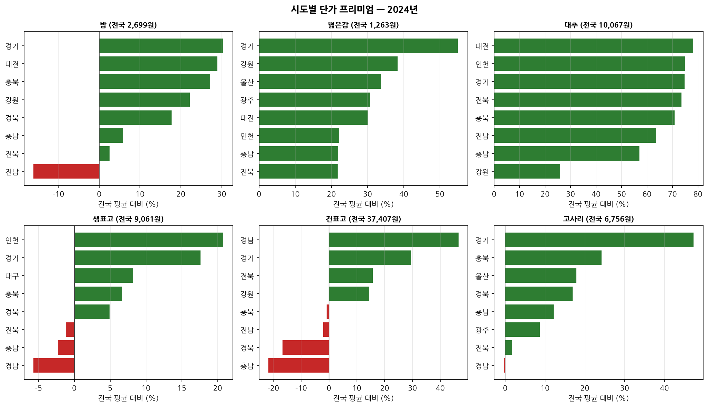

#### 주산지 특화도 (LQ)

| 품목 | 주산지 | LQ | 전국 생산금액 중 비중 |
|---|---|---:|---:|
| 밤 | 충남 | 6.73 | 59.1% |
| 떫은감 | 경북 | 1.93 | 36.6% |
| 대추 | 대구 | 9.80 | 10.7% |
| 생표고 | 충남 | 3.06 | 26.8% |
| 건표고 | 전남 | 2.39 | 26.8% |
| 고사리 | 전남 | 3.35 | 37.6% |
| 더덕 | 제주 | 25.51 | 47.7% |
| 도라지 | 제주 | 5.18 | 9.7% |
| 호두 | 충북 | 3.78 | 26.4% |
| 잣 | 강원 | 5.38 | 95.7% |

알려진 주산지 분포와 일치해 산출식의 타당성을 교차검증할 수 있었다.

#### 1차 가공의 경제성

**생표고→건표고 — 원물 직판이 유리**

생표고 8.0kg가 건표고 1kg이 되므로, 단가 배수가 8.0배를 넘어야 가공이 이득이다. 실제 배수는 4.13배로 이에 미치지 못한다. 원물 1kg을 가공해 얻는 수취액은 4,676원으로 원물 직판(9,061원) 대비 **-48.4%**다. 건조수율은 통상값이며 실제 수율·가공비·설비투자·저장 이점은 반영하지 않았다. 수취액 비교의 방향성만 참고한다.


### 4-10. 출하시기·판로의 수취 단가 효과

임가경제조사와 생산비조사는 "얼마를 투입해 얼마를 벌었나"를 기록하지만 **임가가 실제로
선택한 경영 행동**은 담지 않는다. 「임업경영실태조사」에는 출하시기 구성, 판매처 구성,
저장 경험, 공식인증이 들어 있어, KAMIS 없이도 임업통계만으로 출하시기 효과를 추정할 수 있다.

**추정 방법.** 임가별로 관측되는 것은 연간 총 판매수입 ÷ 총 판매량인 평균 단가 하나뿐이고
시기별 단가는 직접 관측되지 않는다. 임가마다 구성비가 다르다는 점을 이용해

$$단가_i = \sum_k \beta_k \cdot (시기\ k\ 출하비율_i) + \varepsilon_i$$

를 절편 없는 물량가중 회귀로 추정했다. 구성비 합이 100%로 고정되어 절편은 식별되지 않는다.
단가는 음수가 될 수 없으므로 **비음수 최소제곱(NNLS)** 을 쓰고, 계수 불확실성은
**부트스트랩 400회**로 90% 구간을 함께 보고한다. 평균 구성비 3% 미만 계열은 소수 관측에
좌우되어 제외했다.

#### 출하시기별 추정 단가

| 품목 | 최고 시기 | 최저 시기 | 격차 |
|---|---|---|---:|
| 밤 | 수확~추석 5,875원 | 추석후~12월 3,229원 | 1.82배 |
| 떫은감 | 추석후~12월 3,880원 | 수확~추석 2,322원 | 1.67배 |

밤은 **추석 성수기 이후 물량이 몰리는 구간(추석후~12월)이 가장 불리한데, 정작 임가의 54%가
이때 출하한다.** 출하 분산만으로도 개선 여지가 있음을 보여주는 결과다.

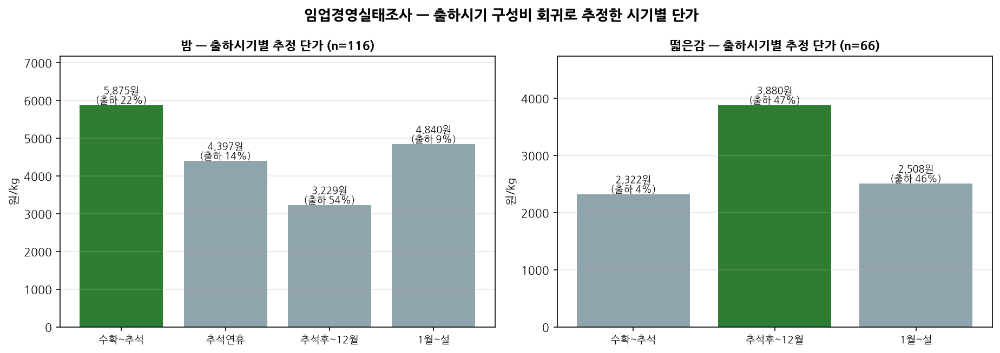

#### 판매처별 추정 단가

| 품목 | 최고 판매처 | 최저 판매처 | 격차 |
|---|---|---|---:|
| 밤 | 직거래 4,115원 | 도소매상 3,039원 | 1.35배 |
| 떫은감 | 가공업체 3,378원 | 농협 2,321원 | 1.46배 |
| 버섯 | 도소매상 19,384원 | 농협 8,044원 | 2.41배 |

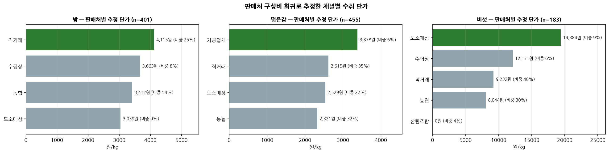

#### 저장·인증 효과

| 품목 | 저장 경험 임가 단가차 | 공식인증 프리미엄 |
|---|---:|---:|
| 밤 | +28.6% | +12.8% |
| 떫은감 | +25.0% | -10.0% |

**해석 유의.** 모두 관측연구의 상관관계이며 인과가 아니다. 저장 설비·인증 취득이 가능한
임가는 애초에 규모·자본·품질이 다르다. 출하시기 문항은 저장 경험이 있는 임가만 응답하므로
표본이 선택적이라는 점도 함께 밝힌다.

### 4-11. 정책 연계 — 자부담 기준 실효 수익률

예측 모델은 총 투입액 대비 수익률을 답하지만, 임가가 실제로 부담하는 돈은 자부담액뿐이다.
보조사업을 활용하면 자기 자금 기준 수익률에는 보조율만큼 지렛대가 걸린다.

$$실효\ ROI = \frac{예측\ ROI}{자부담비율/100}$$

산림청 「보조금 세부사업 정보」 42개 사업(폐지 1건 제외)을
성격별로 분류하고 업종별 관련 분류를 매핑했다.

| 분류 | 사업수 | 최저 자부담 | 최대 지렛대 | 대표 사업 |
|---|---:|---:|---:|---|
| 수출 | 21 | 0% | 10.0배 | 수출촉진검역비 지원 |
| 생산기반 | 3 | 20% | 5.0배 | 산림복합경영단지 |
| 목재·목질 | 10 | 30% | 3.3배 | 주민편의시설용목재팰릿보일러 |
| 유통·가공 | 8 | 30% | 3.3배 | 산지종합유통센터 |

예측 ROI 50%인 임가가 산림복합경영단지(자부담 20%)를 활용하면 자기 자금 기준 **250%** 가 된다.

**다만 지렛대는 위험도 함께 키운다.** 보조율이 높을수록 자기 자금 기준 수익률은 커지지만 위험도 함께 커진다. 사후관리기간 동안 처분·용도변경이 제한되고, 사업이 실패하면 자부담액은 전액 손실이며 보조금 환수 대상이 될 수 있다. 실효 ROI는 성공을 전제한 상한선으로 읽어야 한다.
대시보드는 실효 ROI와 함께 이 경고를 항상 표시한다.

---

## 5) 주요 성과 및 기대효과

### 5-1. 데이터 분석 활용 전 / 후 비교

| 구분 | 데이터 분석 활용 전 (기존) | 데이터 분석 활용 후 (제안 시스템) |
|---|---|---|
| **의사결정 방식** | 전국·지역·업종 단순 평균 통계에 의존 | 개별 임가 특성 맞춤형 머신러닝 예측 |
| **예측 정확도** | R² 0.0428 / MAE 152.9%p | **R² 0.1736 / MAE 137.3%p** (오차 10.2% 감소) |
| **불확실성 안내** | 없음 (평균값이 확정값처럼 읽힘) | **예측구간 제시** (포함률 78%) |
| **경영비 의사결정** | 투입 대비 성과 곡선 부재, 관행적 지출 | 반응곡선으로 **소득 최대 투입 구간** 제시 |
| **출하 시점** | 수확 즉시 출하 관행 | **시기별 수취 단가 정량 제시** (밤 최대 1.82배) |
| **판로 선택** | 기존 거래처 관성 | **판매처별 수취 단가 비교** |
| **품질 관리** | 등급 개선의 금액 효과 불명확 | **등급 전환 시 수취액 증가분 산출** |
| **지역·품목 선택** | 업종별 평균 소득표 열람 | **지역별 실측 단가 · 주산지 특화도** |
| **정책 활용** | 보조사업 정보와 수익성 정보가 분리 | **자부담 기준 실효 수익률**로 통합 |
| **조사 간 연계** | 4종 통계가 각각 별도 공표 | **하나의 화면에서 이어지는 답** |
| **제공 형태** | 연 1회 PDF 통계보고서 | 웹 서비스 상시 조회 (임가용·전문가용 화면 분리) |

### 5-2. 기대되는 경제적 효과

1. **경영비 최적 투입 안내** — 예측 오차가 현행 방식 대비 MAE 기준
   10.2% 작다. 경영비 1,500만원 임가 기준으로 환산하면 임업소득 예측
   오차가 약 2,346,497원
   줄어들며, 그만큼 자금 계획의 정밀도가 높아진다.

2. **출하 분산의 즉각적 효과** — 밤은 추석 후 출하 단가가 수확~추석 대비 55% 수준인데
   임가의 54%가 이 시기에 출하한다. 저장 여력이 있는 임가가 출하를 분산하는 것만으로
   추가 투자 없이 수취액을 높일 수 있다.

3. **등급 관리의 금액 환산** — 밤 소→중 등급 10%p 전환으로 ha당 75,178원. 선별기 도입
   등 품질관리 투자의 회수 기간을 계산할 수 있는 근거가 된다.

4. **신규 진입 위험 저감** — 귀산촌 희망자가 지역·품목·규모별 기대 수익과 **그 변동 폭**을
   사전에 확인할 수 있어, 진입 실패에 따른 사회적 비용을 줄인다.

### 5-3. 정책적 파급효과

| 대상 | 활용 방안 |
|---|---|
| 산림청·한국임업진흥원 | 임업직불금·정책자금 배분 시 지역·업종별 수익성 격차를 근거 데이터로 활용 |
| 지자체 산림부서 | 관내 임가 제원 대입으로 권장 품목·적정 경영비 가이드라인 수립 |
| 산림조합·컨설팅 | 임가 상담 시 정량 근거 제공, 컨설팅 표준화 |
| 통계 생산 기관 | 마이크로데이터 개방의 활용 성과를 실증하여 추가 개방·항목 확충의 정당성 확보 |

### 5-4. 통계 개선 제언

본 분석 과정에서 실제로 부딪힌 제약과 그 근거다.

1. **연도별 스키마·코드 체계 표준화**
   2021년 임가경제조사만 영문 변수코드 접두사가 붙고, `임외소득`↔`임업외소득`처럼 항목명이
   바뀌며, 생산비조사 「경영수준별」은 2022년까지 5·6, 2023년부터 1·2를 쓴다. 마지막 항목은
   파일설계서에 문서화조차 되어 있지 않아, 조화하지 않으면 동일 개념이 연도 코호트로
   오분할된다. **연도 간 항목명·코드 체계의 표준화와 변경 이력 명시**를 제안한다.

2. **전 연도 파일설계서 제공**
   임가경제조사는 2023년분 설계서만 제공되어 2019~2022년은 코드 체계를 추정해야 했다.

3. **단위 표기 명시**
   임업경영실태조사의 판매수입·판매량에 단위 표기가 없어, 임산물생산조사의 밤 물량가중
   단가(2022년 2,429원/kg)와 대조해 '만원·kg'임을 역추정했다. 그 가정에서 밤 단가 중앙값이
   2,555원으로 나와 두 조사가 서로 검증되었지만, **단위는 설계서에 명시되어야 한다.**

4. **조사 간 연계키 제공** ★
   임가경제조사·임산물생산비조사·임산물생산조사·임업경영실태조사에 **임가 단위 연계키가 없어**
   조사 간 결합이 불가능했다. 본 과제가 계층별 분석으로 우회한 이유이며, 연계키가 있다면
   "이 임가가 어떤 비목 구조로 어떤 판로에 팔아 얼마를 벌었는가"를 하나의 모델로 다룰 수 있다.

5. **공간 해상도 확대** ★
   4-7절에서 기상 자료를 결합한 결과 성능이 오히려 하락했는데, 원인은 임가경제조사의 지역
   구분이 **시도 9개뿐**이라는 데 있다. 4,438개 임가가 54개(시도×연도) 기상값을 나눠 갖는
   구조에서는 기상이 사실상 지역 더미로 작동한다. **시군구 코드나 임지 좌표가 제공되면**
   기상·토양·지형 등 외부 공간 데이터와의 결합이 가능해져, 현재 설명되지 않는 임가 간
   성과 편차의 상당 부분을 다룰 수 있을 것으로 기대된다.

6. **표고 등 소표본 품목의 조사 확대**
   생산비조사 표고는 노지 333행·톱밥 212행으로 Test R²가 각각 -0.052, 0.171에 그쳤다.
   버섯류는 임가 수가 적지 않은 만큼 표본 확대를 검토할 만하다.

---

## 부록 A — 재현 방법

```bash
pip install -r requirements.txt

# ① 전처리
python src/preprocess.py          # 임가경제조사
python src/preprocess_cost.py     # 임산물생산비조사

# ② 모델 학습 (CUDA)
N_TRIALS=300 N_GPU=2 python src/train_optuna.py    # Model A
N_TRIALS_COST=200 python src/train_cost.py         # Model B
python src/train_quantile.py                       # 예측구간

# ③ 분석 계층
python src/insights.py      # 등급·수령·선도임가
python src/production.py    # 지역별 단가·특화도
python src/management.py    # 출하시기·판로
python src/subsidy.py       # 보조사업 실효 ROI

# ④ 외부 데이터 (선택)
python scripts/fetch_kamis.py     # KAMIS_CERT_KEY / KAMIS_CERT_ID 환경변수 필요
python scripts/fetch_weather.py   # KMA_AUTH_KEY 환경변수 필요
python src/weather.py             # 시도 단위 집계

# ⑤ 보고서 · 서비스
python src/make_report.py
cd web && npm install && npm run build && cd ..
uvicorn api.main:app --host 0.0.0.0 --port 8000
```

## 부록 B — 구성 파일

| 파일 | 역할 |
|---|---|
| `src/preprocess.py` | 임가경제조사 적재·표준화·정제·파생변수 |
| `src/preprocess_cost.py` | 임산물생산비조사 정규화·품목별 IQR·비목 구성비 |
| `src/train_optuna.py` | Model A — 3종 벤치마크 + CUDA XGBoost 튜닝 |
| `src/train_cost.py` | Model B — 품목 단위 모델 |
| `src/train_quantile.py` | 분위수 회귀 예측구간 |
| `src/insights.py` | 등급별 단가·수령 곡선·선도임가 벤치마크 |
| `src/production.py` | 지역별 단가·주산지 특화도·가공 경제성 |
| `src/management.py` | 출하시기·판매처 수취단가 NNLS 추정 |
| `src/shipping.py` | 임업통계 × KAMIS 융복합 출하 전략 |
| `src/subsidy.py` | 보조사업 자부담 기준 실효 ROI |
| `src/weather.py` | 기상 자료 시도 단위 집계·결합 |
| `src/kamis_client.py`, `src/kma_client.py` | 외부 API 클라이언트 |
| `src/make_report.py` | 본 결과서 자동 생성 |
| `api/` | FastAPI 백엔드 |
| `web/` | Vue 3 프런트엔드 |
| `models/*.json` | 학습된 모델·성능 지표·분석 산출물 |

*본 보고서의 모든 수치는 `models/*.json` 과 `data/processed_*_meta.json` 에서 자동 주입되며,
재학습 후 `python src/make_report.py` 한 번으로 갱신된다.*
